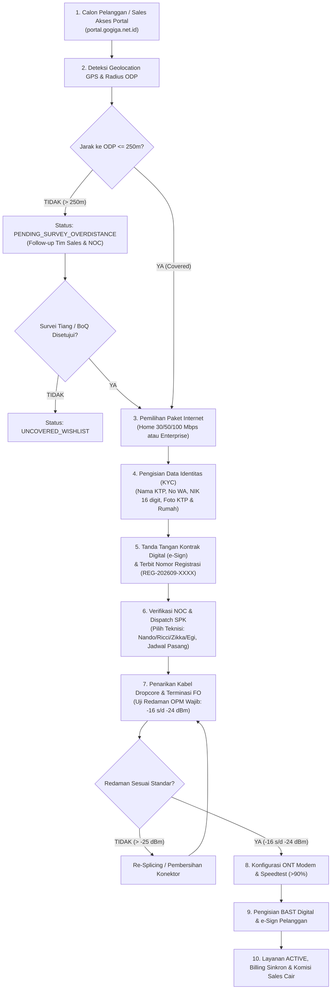

# Prosedur Operasional Standar (SOP) Pendaftaran Pelanggan Baru (Onboarding)
**PT GOGIGA MEDIA TEKNOLOGI — GOGIGANET BROADBAND INTERNET**

- **Nomor Dokumen**: `GMT-SOP-REG-2026-001`
- **Alamat Kantor**: Depan kantor Wali, Jalan Pulutan, Koto Tuo, Kec. Harau, Kabupaten Lima Puluh Kota, Sumatera Barat 26271
- **Tanggal Efektif**: 23 September 2026
- **Status Dokumen**: Disahkan & Berlaku (Production Ready)
- **Disahkan Oleh**: Bapak Aan Rizal S.Kom (Direktur Utama / Owner)
- **Kepala NOC & Core FO**: Nando Azkia Putra S.Kom
- **Versi Notepad**: [`PROSEDUR_PENDAFTARAN_PELANGGAN_BARU.txt`](file:///c:/Users/62811/Documents/ISP/PROSEDUR_PENDAFTARAN_PELANGGAN_BARU.txt)

---

## 1. Diagram Alur Prosedur Pendaftaran

---

## 2. Rincian 8 Langkah Operasional Pendaftaran

### Tahap 1: Pengecekan Coverage & Geolocation ODP
1. Calon pelanggan membuka portal resmi di `https://portal.gogiga.net.id` atau melalui tautan referral Sales resmi (`https://portal.gogiga.net.id/?ref=FAJAR-PYK`).
2. Menekan tombol **"Gunakan Lokasi Saya Saat Ini"** atau menggeser pin lokasi tepat di atas atap rumah calon pelanggan.
3. Algoritma backend menghitung jarak lurus ke tiang Optical Distribution Point (ODP) terdekat:
   - **Jarak $\le 250\text{ meter}$ (Covered)**: Indikator hijau, menampilkan kode ODP terdekat dan sisa port. Calon pelanggan dapat langsung memilih paket.
   - **Jarak $> 250\text{ meter}$ (Overdistance)**: Indikator kuning, berkas pendaftaran akan diproses ke antrean survei khusus teknisi/sales.

### Tahap 2: Pemilihan Paket Internet
Pilihan paket internet simetris 1:1 tanpa kuota (unlimited tanpa FUP):
- **GOGIGA HOME 30**: 30 Mbps Simetris (Rp 175.000 / bulan)
- **GOGIGA HOME 50**: 50 Mbps Simetris (Rp 225.000 / bulan)
- **GOGIGA HOME 100**: 100 Mbps Simetris (Rp 325.000 / bulan)
- **CUSTOM ENTERPRISE**: Dedicated Bandwidth, opsi IP Publik Statis, SLA 99.5%, cocok untuk instansi, kantor, atau perhotelan.

### Tahap 3: Pengisian Data Identitas & Verifikasi Anti-Duplikasi (KYC)
Calon pelanggan mengisi formulir pendaftaran:
- **Nama Lengkap**: Sesuai dengan e-KTP.
- **Nomor WhatsApp**: Aktif untuk menerima nomor registrasi, link tracking, dan tagihan bulanan.
- **NIK KTP**: 16 digit angka valid (sistem otomatis mendeteksi dan mencegah registrasi ganda).
- **Foto Dokumen**: Foto fisik e-KTP dan foto fasad depan rumah tempat pemasangan.
- **PIC Lapangan**: Diisi jika pemohon berbeda dengan penghuni rumah saat teknisi datang.
- **Kode Referral**: Terisi otomatis sesuai sales pendamping (contoh: `FAJAR-PYK`) atau teknisi (`NANDO-TECH`, `RICCI-TECH`, `ZIKKA-TECH`, `EGI-TECH`).

### Tahap 4: Tanda Tangan Kontrak Digital (e-Sign) & Terbit Nomor Registrasi
1. Calon pelanggan menelaah ringkasan syarat dan ketentuan berlangganan.
2. Membubuhkan tanda tangan digital pada kotak canvas tanda tangan di layar.
3. Menekan tombol **"AJUKAN PEMASANGAN BARU"**.
4. Sistem menerbitkan Nomor Registrasi Resmi: format `REG-YYYYMM-XXXX`.

### Tahap 5: Verifikasi NOC & Dispatch Surat Perintah Kerja (SPK)
1. Kepala NOC & Core FO (**Nando Azkia Putra S.Kom** / `nando_noc`) login di `https://noc-fo.gogiga.net.id`.
2. Melakukan review kesesuaian KTP, titik koordinat, dan ketersediaan port ODP tujuan ($\le 8\text{ port}$).
3. Menunjuk teknisi pelaksana (**Nando, Ricci, Zikka, atau Egi**), memilih tanggal dan jam instalasi, serta menyertakan catatan teknis tarikan FO.
4. Klik **"Terbitkan SPK Teknisi"** $\rightarrow$ Status pendaftaran berubah menjadi `INSTALLATION_SCHEDULED`.

### Tahap 6: Eksekusi Lapangan & Standar Pengukuran Redaman OPM
1. Teknisi bertugas login di `https://teknisi.gogiga.net.id` melalui smartphone di lapangan.
2. Penarikan kabel dropcore fiber optik G.657A tahan lekukan:
   - Lintasan jalan raya minimal ketinggian 5,5 meter.
   - Pemasangan klem pengaman (S-Clamp) di setiap tiang dan drip loop sebelum masuk dinding rumah.
3. Penyambungan (splicing) pada adapter ODP dan roset dalam rumah.
4. **Pengukuran Optical Power Meter (OPM)**:
   - **Standar Layak**: $-16.0\text{ dBm}$ s/d $-24.0\text{ dBm}$.
   - **Nilai Ideal**: $-18.0\text{ dBm}$ s/d $-20.0\text{ dBm}$.
   - **Kritis / Buruk**: Lebih tinggi dari $-25.0\text{ dBm}$ *(Wajib potong dan sambung ulang/re-splice!)*.
5. Konfigurasi modem ONT Dual Band, nama Wi-Fi (SSID), password, serta uji speedtest minimal 90% dari kapasitas paket.

### Tahap 7: Berita Acara Serah Terima (BAST) Digital
1. Teknisi menginput nomor seri modem (SN ONT), MAC Address, panjang kabel, dan angka redaman OPM.
2. Mengunggah foto hasil redaman di alat OPM dan foto modem terpasang rapi.
3. Pelanggan melakukan uji coba koneksi dan menandatangani BAST Digital langsung di layar smartphone teknisi.
4. Teknisi menekan tombol **"SUBMIT BAST & AKTIFKAN LAYANAN"**.

### Tahap 8: Aktivasi Sistem & Billing Otomatis
1. Status registrasi otomatis diperbarui menjadi `ACTIVE`.
2. Port ODP terpakai bertambah otomatis di database.
3. Layanan disinkronkan ke sistem billing (GigaBill) untuk penagihan rutin bulanan.
4. Komisi penjualan untuk Sales (`FAJAR-PYK` Rp 50.000 / pelanggan retail) otomatis tercatat dan bertambah di dashboard sales.
5. Notifikasi WhatsApp resmi dikirimkan ke pelanggan berisi ucapan selamat datang dan informasi akun.

---

## 3. Matriks Peran & Tanggung Jawab (RACI)

| Tahapan Operasional | Calon Pelanggan | Sales (`fajar` - Fajar Malem Sitepu) | NOC (`nando_noc` - Nando S.Kom) | Teknisi (`nando` dkk) | Owner (`owner` - Aan Rizal S.Kom) |
| :--- | :---: | :---: | :---: | :---: | :---: |
| 1. Cek Jangkauan ODP & Pilih Paket | **R** | **A** | I | I | I |
| 2. Input Identitas & Tanda Tangan Kontrak | **R** | C | I | I | I |
| 3. Penanganan Overdistance / BoQ Khusus | C | **R** | C | C | **A** |
| 4. Verifikasi KYC & Dispatch SPK | I | I | **R / A** | I | I |
| 5. Penarikan Dropcore & Uji Redaman OPM | I | I | C | **R / A** | I |
| 6. Serah Terima & BAST Digital | C | I | I | **R** | I |
| 7. Aktivasi Billing & Pencairan Komisi | I | I | **R** | I | **A** |

*Keterangan: **R** = Responsible (Pelaksana), **A** = Accountable (Pengambil Keputusan/Penanggung Jawab), **C** = Consulted (Konsultasi), **I** = Informed (Menerima Informasi).*

---

## 4. Standar Waktu Layanan (SLA)

| Aktivitas | Target SLA |
| :--- | :--- |
| **Verifikasi KYC oleh NOC** | $\le 2\text{ Jam}$ sejak formulir disubmit |
| **Penerbitan Jadwal & SPK Pemasangan** | $\le 4\text{ Jam}$ sejak verifikasi disetujui |
| **Durasi Pemasangan Fisik Lapangan** | $1,5 - 2,5\text{ Jam}$ per titik lokasi |
| **Total Waktu Dari Daftar s/d Internet Aktif** | **Maksimal 1 x 24 Jam** (Hari Kerja) |
